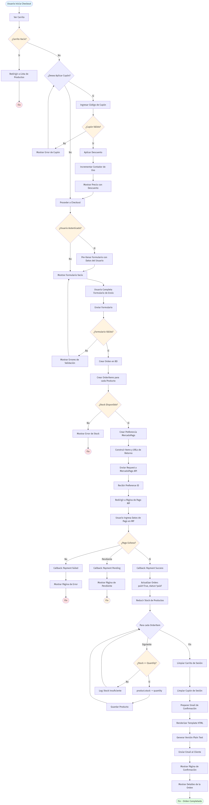

# Diagrama de Actividades - Nam Nam Chicken

## Descripción
Este diagrama muestra el flujo completo del proceso de checkout (compra) en el sistema, desde que el usuario visualiza su carrito hasta que recibe la confirmación de la orden.

## Diagrama

```mermaid
flowchart TD
    Start([Usuario Inicia Checkout]) --> ViewCart[Ver Carrito]

    ViewCart --> CheckCartEmpty{¿Carrito Vacío?}

    CheckCartEmpty -->|Sí| RedirectProducts[Redirigir a Lista de Productos]
    RedirectProducts --> End1([Fin])

    CheckCartEmpty -->|No| CheckCoupon{¿Desea Aplicar Cupón?}

    CheckCoupon -->|Sí| EnterCoupon[Ingresar Código de Cupón]
    EnterCoupon --> ValidateCoupon{¿Cupón Válido?}

    ValidateCoupon -->|No| ShowCouponError[Mostrar Error de Cupón]
    ShowCouponError --> CheckCoupon

    ValidateCoupon -->|Sí| ApplyCoupon[Aplicar Descuento]
    ApplyCoupon --> IncrementCoupon[Incrementar Contador de Uso]
    IncrementCoupon --> ShowDiscount[Mostrar Precio con Descuento]
    ShowDiscount --> ProceedCheckout

    CheckCoupon -->|No| ProceedCheckout[Proceder a Checkout]

    ProceedCheckout --> CheckAuth{¿Usuario Autenticado?}

    CheckAuth -->|Sí| PreFillForm[Pre-llenar Formulario con Datos del Usuario]
    PreFillForm --> ShowForm

    CheckAuth -->|No| ShowForm[Mostrar Formulario Vacío]

    ShowForm --> UserFillsForm[Usuario Completa Formulario de Envío]
    UserFillsForm --> SubmitForm[Enviar Formulario]

    SubmitForm --> ValidateForm{¿Formulario Válido?}

    ValidateForm -->|No| ShowFormErrors[Mostrar Errores de Validación]
    ShowFormErrors --> ShowForm

    ValidateForm -->|Sí| CreateOrder[Crear Orden en BD]

    CreateOrder --> CreateOrderItems[Crear OrderItems para cada Producto]

    CreateOrderItems --> CheckStock{¿Stock Disponible?}

    CheckStock -->|No| ShowStockError[Mostrar Error de Stock]
    ShowStockError --> End2([Fin])

    CheckStock -->|Sí| CreateMPPreference[Crear Preferencia MercadoPago]

    CreateMPPreference --> BuildMPData[Construir Items y URLs de Retorno]
    BuildMPData --> SendMPRequest[Enviar Request a MercadoPago API]

    SendMPRequest --> ReceiveMPResponse[Recibir Preference ID]
    ReceiveMPResponse --> RedirectMP[Redirigir a Página de Pago MP]

    RedirectMP --> UserPays[Usuario Ingresa Datos de Pago en MP]

    UserPays --> ProcessPayment{¿Pago Exitoso?}

    ProcessPayment -->|No| PaymentFailed[Callback: Payment Failed]
    PaymentFailed --> ShowFailure[Mostrar Página de Error]
    ShowFailure --> End3([Fin])

    ProcessPayment -->|Pendiente| PaymentPending[Callback: Payment Pending]
    PaymentPending --> ShowPending[Mostrar Página de Pendiente]
    ShowPending --> End4([Fin])

    ProcessPayment -->|Sí| PaymentSuccess[Callback: Payment Success]

    PaymentSuccess --> UpdateOrder[Actualizar Orden: paid=True, status='paid']

    UpdateOrder --> ReduceStock[Reducir Stock de Productos]

    ReduceStock --> LoopItems{Para cada OrderItem}

    LoopItems -->|Siguiente| CheckItemStock{¿Stock >= Quantity?}

    CheckItemStock -->|Sí| DecreaseStock[product.stock -= quantity]
    DecreaseStock --> SaveProduct[Guardar Producto]
    SaveProduct --> LoopItems

    CheckItemStock -->|No| LogStockIssue[Log: Stock Insuficiente]
    LogStockIssue --> LoopItems

    LoopItems -->|Fin| ClearCart[Limpiar Carrito de Sesión]

    ClearCart --> ClearCoupon[Limpiar Cupón de Sesión]

    ClearCoupon --> PrepareEmail[Preparar Email de Confirmación]

    PrepareEmail --> RenderEmailTemplate[Renderizar Template HTML]
    RenderEmailTemplate --> StripTags[Generar Versión Plain Text]
    StripTags --> SendEmail[Enviar Email al Cliente]

    SendEmail --> ShowSuccess[Mostrar Página de Confirmación]
    ShowSuccess --> DisplayOrderDetails[Mostrar Detalles de la Orden]

    DisplayOrderDetails --> End5([Fin - Orden Completada])

    style Start fill:#e1f5ff
    style End1 fill:#ffe1e1
    style End2 fill:#ffe1e1
    style End3 fill:#ffe1e1
    style End4 fill:#fff4e1
    style End5 fill:#e1ffe1
    style ProcessPayment fill:#fff4e1
    style CheckCartEmpty fill:#fff4e1
    style ValidateCoupon fill:#fff4e1
    style CheckAuth fill:#fff4e1
    style ValidateForm fill:#fff4e1
    style CheckStock fill:#fff4e1
    style CheckItemStock fill:#fff4e1
```



<details>
<summary>Ver código Mermaid</summary>



</details>

## Descripción del Flujo

### 1. Inicio del Proceso
El usuario inicia el proceso de checkout desde la página del carrito haciendo clic en "Proceed to Checkout".

### 2. Validación del Carrito
**Decision Point**: ¿Carrito Vacío?
- **Sí**: Redirigir a la lista de productos (no se puede hacer checkout sin items)
- **No**: Continuar al siguiente paso

### 3. Aplicación de Cupón (BONUS - Opcional)
**Decision Point**: ¿Desea Aplicar Cupón?
- **Sí**:
  1. Usuario ingresa código de cupón
  2. Sistema valida el cupón (código, fechas, límite de uso)
  3. Si válido: aplicar descuento, incrementar contador, mostrar precio reducido
  4. Si inválido: mostrar error, permitir reintentar o continuar sin cupón
- **No**: Continuar con precio normal

**Validaciones del Cupón**:
- Cupón existe en la base de datos
- active = True
- Fecha actual entre valid_from y valid_to
- used_count < usage_limit

### 4. Verificación de Autenticación
**Decision Point**: ¿Usuario Autenticado?
- **Sí**: Pre-llenar formulario con datos del perfil (nombre, email, dirección)
- **No**: Mostrar formulario vacío (guest checkout)

### 5. Completar Información de Envío
Usuario completa el formulario con:
- first_name, last_name
- email
- address
- celular (teléfono)
- notes (instrucciones especiales - opcional)

**Validación del Formulario**:
- Todos los campos requeridos completos
- Email válido
- Formato de teléfono válido
- Si inválido: mostrar errores, permitir corrección

### 6. Creación de la Orden
**Paso 1**: Crear registro Order en la base de datos
- Asociar user_id si está autenticado
- Guardar información de envío
- status = 'pending', paid = False

**Paso 2**: Crear OrderItems
- Para cada item en el carrito
- Guardar product_id, price (precio al momento de la compra), quantity

### 7. Verificación de Stock
**Decision Point**: ¿Stock Disponible?
- **No**: Mostrar error, terminar proceso (evitar ventas sin inventario)
- **Sí**: Continuar (stock se reduce después del pago, no antes)

### 8. Integración con MercadoPago
**Paso 1**: Crear Preferencia de Pago
- Construir lista de items para MP (title, quantity, unit_price)
- Configurar URLs de retorno:
  - success: /shop/payment-success/{order_id}/
  - failure: /shop/payment-failure/{order_id}/
  - pending: /shop/payment-pending/{order_id}/
- auto_return = "approved"

**Paso 2**: Enviar Request a MercadoPago API
- SDK: mercadopago.SDK(ACCESS_TOKEN)
- preference().create(preference_data)

**Paso 3**: Recibir Preference ID
- MercadoPago devuelve preference['id']

**Paso 4**: Redirigir al Usuario
- Renderizar página de pago con:
  - preference_id
  - public_key (MERCADOPAGO_PUBLIC_KEY)
  - MercadoPago checkout widget

### 9. Procesamiento del Pago
**Usuario en MercadoPago**:
- Ingresa datos de tarjeta o selecciona otro método
- MercadoPago procesa el pago
- MercadoPago redirige según resultado

**Decision Point**: ¿Pago Exitoso?

#### Opción A: Pago Exitoso
- Callback: payment_success(request, order_id)
- Continuar al paso 10

#### Opción B: Pago Fallido
- Callback: payment_failure(request, order_id)
- Mostrar página de error
- Permitir reintentar o cancelar

#### Opción C: Pago Pendiente
- Callback: payment_pending(request, order_id)
- Mostrar página de pendiente
- Notificar cuando se confirme (webhook - no implementado en v1)

### 10. Actualización de la Orden (Solo si Pago Exitoso)
```python
order.paid = True
order.status = Order.STATUS_PAID  # 'paid'
order.save()
```

### 11. Reducción de Stock
**Loop**: Para cada OrderItem en order.items.all()
1. Obtener product del item
2. **Decision**: ¿product.stock >= item.quantity?
   - **Sí**:
     - product.stock -= item.quantity
     - product.save()
   - **No**:
     - Log error (no debería ocurrir si validación previa fue correcta)
     - Continuar (no bloquear confirmación si ya se pagó)

### 12. Limpieza de Sesión
**Paso 1**: Limpiar Carrito
```python
cart.clear()  # Elimina CART_SESSION_ID
```

**Paso 2**: Limpiar Cupón
```python
cart.clear_coupon()  # Elimina coupon_id de sesión
```

### 13. Notificación por Email
**Paso 1**: Preparar Datos
- order object completo
- order.items.all() con productos y precios

**Paso 2**: Renderizar Template
```python
html_message = render_to_string('shop/order/order_confirmation_email.html', {'order': order})
```

**Paso 3**: Generar Versión Plain Text
```python
plain_message = strip_tags(html_message)
```

**Paso 4**: Enviar Email
```python
send_mail(
    subject=f'Order nr. {order.id} from Nam Nam Chicken',
    message=plain_message,
    from_email=settings.DEFAULT_FROM_EMAIL,
    recipient_list=[order.email],
    html_message=html_message
)
```

### 14. Confirmación al Usuario
**Página de Éxito**:
- Mostrar mensaje de éxito
- Mostrar número de orden
- Mostrar detalles completos:
  - Items comprados
  - Cantidades y precios
  - Total pagado
  - Información de envío
- Mostrar estado: "Paid" (pagado)

### 15. Fin del Proceso
Proceso de checkout completado exitosamente. Usuario puede:
- Ver historial de compras (si está registrado)
- Continuar comprando
- Cerrar sesión

## Swimlanes (Responsabilidades)

### Usuario
- Visualizar carrito
- Aplicar cupón (opcional)
- Completar formulario de envío
- Ingresar datos de pago en MercadoPago
- Recibir confirmación

### Sistema (Django)
- Validar carrito
- Validar cupón
- Validar formulario
- Crear orden y order items
- Verificar stock
- Crear preferencia MercadoPago
- Procesar callbacks
- Actualizar orden
- Reducir stock
- Limpiar sesión
- Enviar email

### MercadoPago
- Recibir datos de pago
- Procesar transacción
- Enviar callback de resultado
- Redirigir usuario

### Email Service
- Enviar email de confirmación

## Puntos de Decisión Críticos

1. **Carrito Vacío**: Previene checkout sin productos
2. **Cupón Válido**: Valida descuentos antes de aplicar
3. **Usuario Autenticado**: Mejora UX con pre-llenado
4. **Formulario Válido**: Asegura datos correctos de envío
5. **Stock Disponible**: Previene overselling
6. **Pago Exitoso**: Punto crítico - solo aquí se confirma la venta
7. **Stock Suficiente en Loop**: Validación adicional durante reducción

## Casos de Error y Recuperación

### Error: Carrito Vacío
- **Acción**: Redirigir a productos
- **Recuperación**: Usuario agrega productos

### Error: Cupón Inválido
- **Acción**: Mostrar error
- **Recuperación**: Reintentar con otro código o continuar sin cupón

### Error: Formulario Inválido
- **Acción**: Mostrar errores de validación
- **Recuperación**: Usuario corrige datos

### Error: Sin Stock
- **Acción**: Mostrar error, no crear orden
- **Recuperación**: Usuario ajusta cantidad o elige otros productos

### Error: Pago Fallido
- **Acción**: Mostrar página de error
- **Recuperación**: Usuario puede reintentar pago o cancelar

### Error: Pago Pendiente
- **Acción**: Mostrar página de pendiente
- **Recuperación**: Sistema notifica cuando se confirma (webhook)

## Tiempo Estimado del Flujo

- **Usuario Rápido**: 2-3 minutos (usuario registrado, sin cupón, pago inmediato)
- **Usuario Promedio**: 5-7 minutos (guest, con cupón, revisa datos)
- **Usuario Lento**: 10+ minutos (indeciso, múltiples intentos de cupón, problemas de pago)

## Mejoras Futuras (No Implementadas)

1. **Guest Checkout Tracking**: Link único para guests para ver su orden
2. **Webhooks de MercadoPago**: Actualización automática de estado
3. **Reintento Automático**: Si falla reducción de stock, revertir orden
4. **Notificaciones SMS**: Confirmación por teléfono
5. **Guardado de Dirección**: Múltiples direcciones para usuarios registrados
6. **Checkout Rápido**: Un clic para usuarios frecuentes