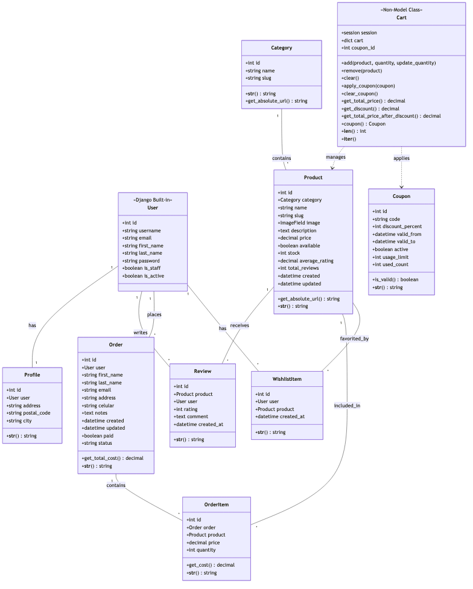
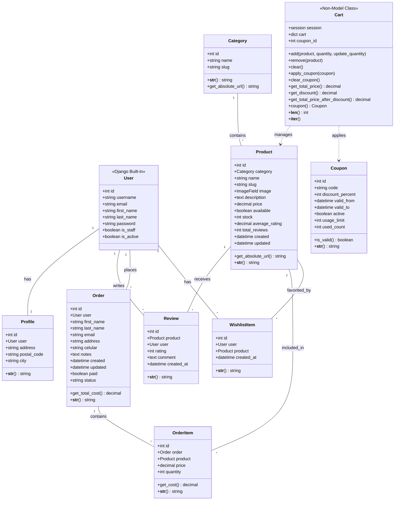

# Diagrama de Clases - Nam Nam Chicken

## Descripción
Este diagrama muestra la estructura de clases del sistema, incluyendo todos los modelos Django, sus atributos, métodos y relaciones.

## Diagrama

Ver código Mermaid

