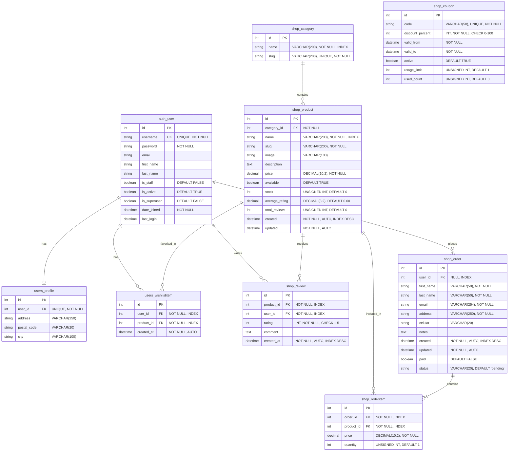

# Diagrama Entidad-Relación - Nam Nam Chicken

## Descripción
Este diagrama muestra la estructura de la base de datos con todas las tablas, sus campos, tipos de datos, claves primarias (PK), claves foráneas (FK) y relaciones.

## Explicación de Tablas y Relaciones

### Tablas Principales

#### auth_user (Django Built-in)
- **PK**: id (AutoField)
- **Unique Keys**: username
- **Descripción**: Tabla estándar de usuarios de Django
- **Relaciones**:
  - 1:1 con users_profile
  - 1:N con users_wishlistitem, shop_review, shop_order

#### users_profile
- **PK**: id (AutoField)
- **FK**: user_id → auth_user.id (OneToOne)
- **Unique Constraints**: user_id (único por usuario)
- **Descripción**: Perfil extendido del usuario con información de dirección
- **Trigger**: Se crea automáticamente al crear un usuario (signal post_save)

#### shop_category
- **PK**: id (AutoField)
- **Unique Keys**: slug
- **Indexes**: name
- **Descripción**: Categorías de productos (ej: "Chicken", "Burgers", "Sides")

#### shop_product
- **PK**: id (AutoField)
- **FK**: category_id → shop_category.id
- **Indexes**:
  - (id, slug) - compuesto
  - name
  - created (descendente)
- **Descripción**: Productos del menú con stock, precio y ratings
- **Business Logic**:
  - available controla visibilidad
  - stock se decrementa en cada venta exitosa
  - average_rating y total_reviews se actualizan con reviews

#### shop_review
- **PK**: id (AutoField)
- **FK**:
  - product_id → shop_product.id
  - user_id → auth_user.id
- **Unique Constraints**: (product_id, user_id) - un usuario solo puede hacer una review por producto
- **Indexes**: created_at (descendente)
- **Validations**: rating debe estar entre 1 y 5

#### shop_order
- **PK**: id (AutoField)
- **FK**: user_id → auth_user.id (nullable, SET_NULL)
- **Indexes**: created (descendente)
- **Descripción**: Órdenes de compra
- **Status Flow**: pending → paid → processing → shipped → delivered
- **Business Logic**:
  - user_id puede ser NULL (órdenes de guests)
  - paid se marca True después del pago exitoso
  - status se actualiza durante el ciclo de vida del pedido

#### shop_orderitem
- **PK**: id (AutoField)
- **FK**:
  - order_id → shop_order.id (CASCADE)
  - product_id → shop_product.id (CASCADE)
- **Descripción**: Items individuales de cada orden
- **Business Logic**:
  - price se guarda para mantener histórico (puede diferir del precio actual)
  - CASCADE delete: si se borra la orden, se borran los items

#### users_wishlistitem
- **PK**: id (AutoField)
- **FK**:
  - user_id → auth_user.id (CASCADE)
  - product_id → shop_product.id (CASCADE)
- **Unique Constraints**: (user_id, product_id) - un producto solo puede estar una vez en la wishlist
- **Indexes**: created_at (descendente)

#### shop_coupon
- **PK**: id (AutoField)
- **Unique Keys**: code
- **Indexes**: valid_from (descendente)
- **Descripción**: Cupones de descuento
- **Validations**:
  - discount_percent entre 0 y 100
  - usage_limit controla uso máximo
  - used_count incrementa con cada uso
- **Business Logic**: is_valid() verifica active, fechas y límite de uso

### Cardinalidades

- **1:1**: auth_user ↔ users_profile
- **1:N**:
  - auth_user → shop_review
  - auth_user → shop_order
  - auth_user → users_wishlistitem
  - shop_category → shop_product
  - shop_product → shop_review
  - shop_product → shop_orderitem
  - shop_product → users_wishlistitem
  - shop_order → shop_orderitem
- **N:M** (via tabla intermedia):
  - auth_user ↔ shop_product (via users_wishlistitem)

### Índices y Optimizaciones

1. **Índices Simples**:
   - shop_category: name
   - shop_product: name, created (DESC)
   - shop_review: created_at (DESC)
   - shop_order: created (DESC)
   - users_wishlistitem: created_at (DESC)

2. **Índices Compuestos**:
   - shop_product: (id, slug) - para URLs amigables

3. **Índices de Foreign Keys**:
   - Django crea automáticamente índices en todas las FK

4. **Unique Constraints**:
   - shop_review: (product_id, user_id)
   - users_wishlistitem: (user_id, product_id)

### Constraints y Validaciones

1. **NOT NULL**:
   - Todos los campos requeridos para operación del negocio

2. **CHECK Constraints**:
   - shop_review.rating: 1 ≤ rating ≤ 5
   - shop_coupon.discount_percent: 0 ≤ discount_percent ≤ 100

3. **DEFAULT Values**:
   - Boolean fields: False/True según lógica de negocio
   - Integer counters: 0
   - Status: 'pending'

4. **CASCADE Behaviors**:
   - shop_orderitem → shop_order: CASCADE (borrar orden borra items)
   - shop_product → shop_category: CASCADE (borrar categoría borra productos)
   - users_wishlistitem: CASCADE en ambas FK
   - shop_order.user_id: SET_NULL (preservar órdenes de usuarios borrados)