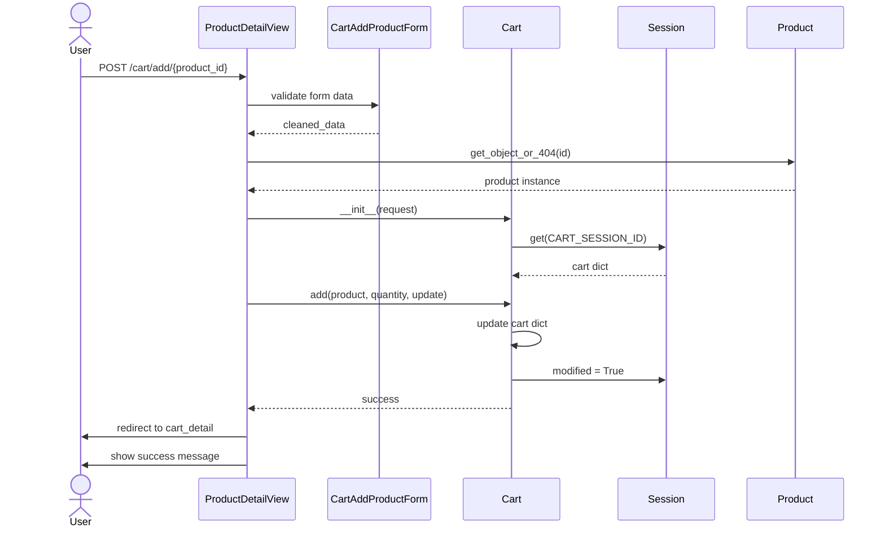
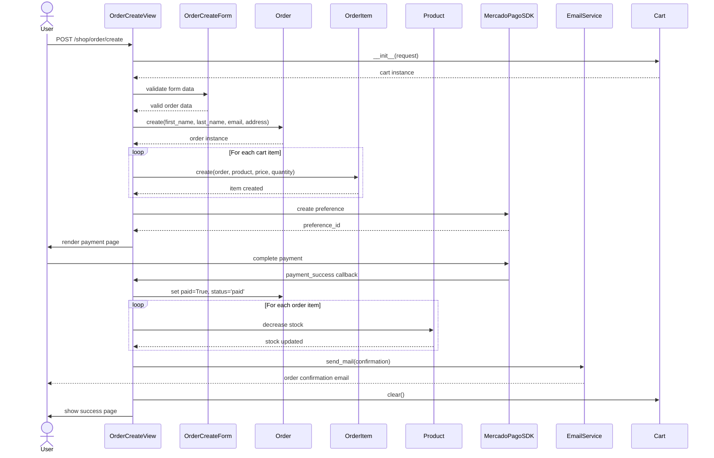
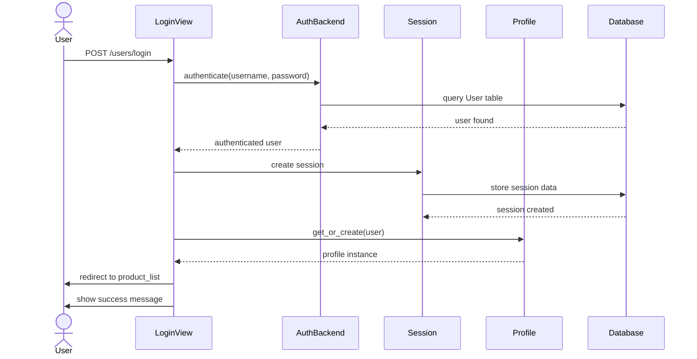
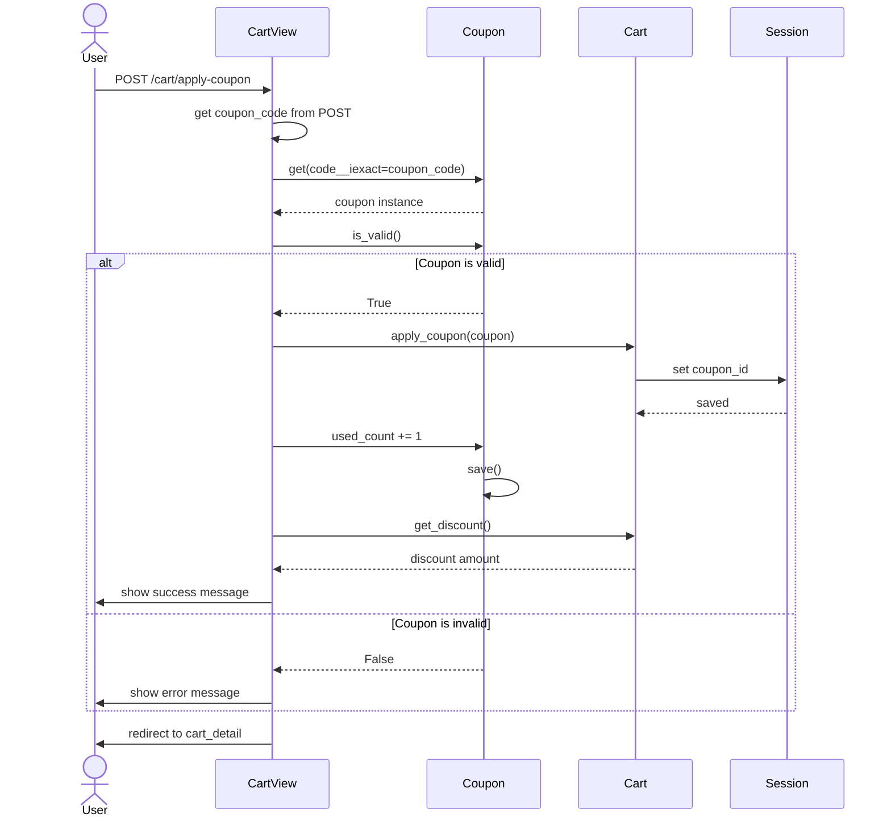
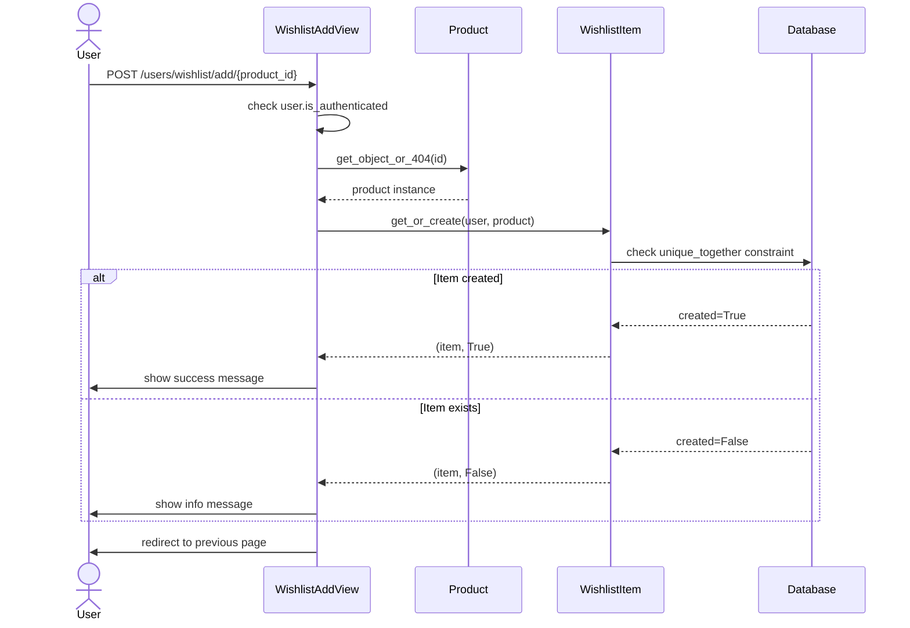
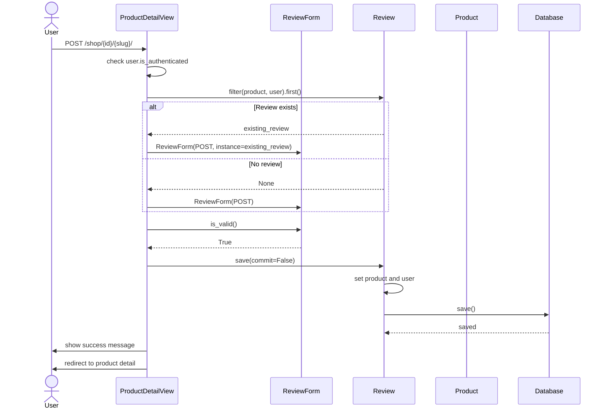

# Diagramas de Secuencia - Nam Nam Chicken

## Descripción
Estos diagramas muestran la interacción entre objetos en diferentes flujos del sistema.

## 1. Agregar Producto al Carrito

## 2. Completar Compra (Checkout)

## 3. Proceso de Login

## 4. Aplicar Cupón (BONUS)

## 5. Agregar a Lista de Deseos (BONUS)

## 6. Publicar Reseña (BONUS)

## Explicación de Elementos Clave

### Actores y Participantes
- **User**: El usuario final del sistema
- **Views**: Controladores Django que manejan las peticiones HTTP
- **Models**: Clases de modelo Django que representan entidades de la base de datos
- **Cart**: Clase auxiliar para gestionar el carrito de compras en sesión
- **Session**: Sistema de sesiones de Django
- **MercadoPagoSDK**: SDK de integración con pasarela de pagos
- **EmailService**: Servicio de envío de correos electrónicos

### Flujos Principales
1. **Add to Cart**: Gestión de productos en carrito mediante sesión
2. **Checkout**: Proceso completo de compra con reducción de stock y confirmación
3. **Login**: Autenticación de usuario con creación de perfil automática
4. **Apply Coupon**: Validación y aplicación de cupones de descuento
5. **Wishlist**: Gestión de lista de deseos con prevención de duplicados
6. **Review**: Publicación y edición de reseñas de productos
