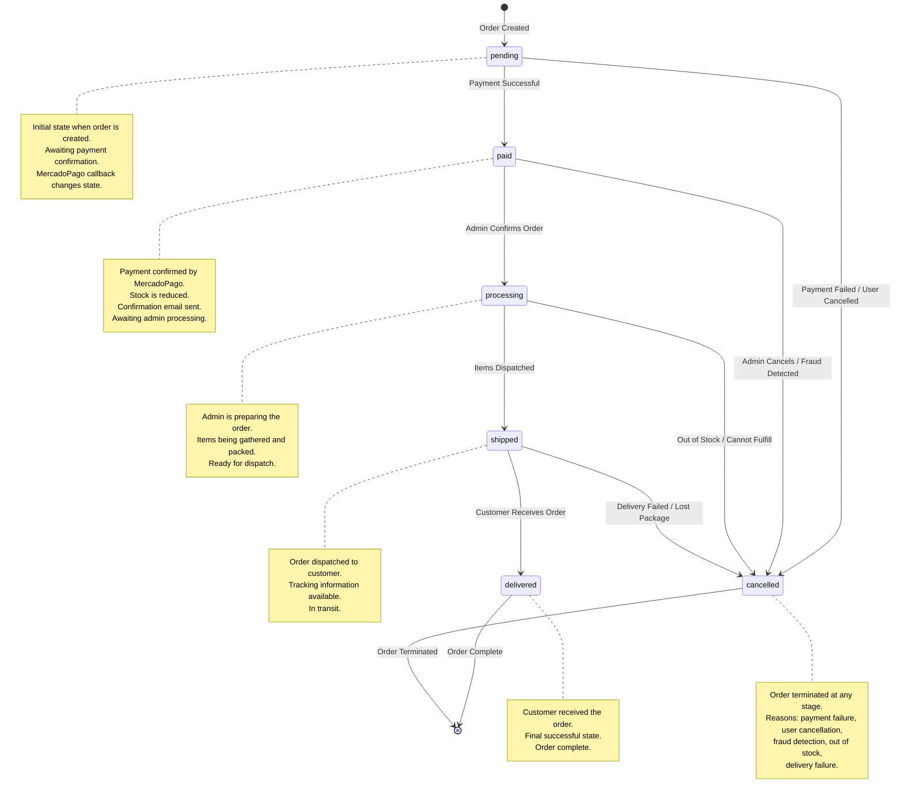

# Diagrama de Máquina de Estados - Nam Nam Chicken

## Descripción
Este diagrama muestra las transiciones de estado del ciclo de vida de una orden (Order) en el sistema.



## Estados del Order

### Estados Principales

1. **pending** (Pendiente)
   - **Descripción**: Estado inicial cuando se crea la orden
   - **Condición**: Order.paid = False, Order.status = 'pending'
   - **Duración**: Hasta que se complete o falle el pago
   - **Acciones**:
     - Orden creada en la base de datos
     - OrderItems creados
     - Preferencia de MercadoPago generada
     - Esperando confirmación de pago

2. **paid** (Pagado)
   - **Descripción**: Pago confirmado por MercadoPago
   - **Condición**: Order.paid = True, Order.status = 'paid'
   - **Trigger**: Callback success de MercadoPago
   - **Acciones**:
     - Stock de productos reducido
     - Email de confirmación enviado
     - Carrito limpiado
     - Esperando que admin procese la orden

3. **processing** (En Procesamiento)
   - **Descripción**: Admin está preparando la orden
   - **Condición**: Order.status = 'processing'
   - **Trigger**: Admin confirma la orden en Django Admin
   - **Acciones**:
     - Items siendo recolectados y empacados
     - Preparación para envío
     - Estado visible para el cliente

4. **shipped** (Enviado)
   - **Descripción**: Orden despachada al cliente
   - **Condición**: Order.status = 'shipped'
   - **Trigger**: Admin marca como enviado
   - **Acciones**:
     - Información de tracking disponible
     - Notificación al cliente (opcional)
     - En tránsito

5. **delivered** (Entregado)
   - **Descripción**: Cliente recibió la orden - Estado final exitoso
   - **Condición**: Order.status = 'delivered'
   - **Trigger**: Confirmación de entrega
   - **Acciones**:
     - Orden completada exitosamente
     - Estado final
     - Cliente puede dejar reviews de productos

6. **cancelled** (Cancelado)
   - **Descripción**: Orden cancelada/terminada - Estado final de error
   - **Condición**: Order.status = 'cancelled'
   - **Triggers Posibles**:
     - Falla de pago
     - Cancelación por usuario
     - Detección de fraude
     - Sin stock
     - Falla en entrega
   - **Acciones**:
     - Stock devuelto (si se redujo)
     - Reembolso procesado (si aplica)
     - Notificación al cliente

## Transiciones de Estado

### Transiciones Válidas

```
pending → paid: Payment successful (MercadoPago callback)
pending → cancelled: Payment failed or user cancelled

paid → processing: Admin confirms order
paid → cancelled: Admin cancels or fraud detected

processing → shipped: Items dispatched
processing → cancelled: Out of stock or cannot fulfill

shipped → delivered: Customer receives order
shipped → cancelled: Delivery failed or lost package

delivered → [END]: Order complete
cancelled → [END]: Order terminated
```

### Transiciones No Permitidas

- No se puede retroceder de estados (ej: delivered → shipped)
- No se puede saltar estados (ej: pending → delivered)
- No se puede reactivar una orden cancelled
- delivered es irreversible (estado terminal exitoso)
- cancelled es irreversible (estado terminal de error)

## Implementación en el Código

### Modelo (shop/models.py)

```python
class Order(models.Model):
    STATUS_PENDING = 'pending'
    STATUS_PAID = 'paid'
    STATUS_PROCESSING = 'processing'
    STATUS_SHIPPED = 'shipped'
    STATUS_DELIVERED = 'delivered'
    STATUS_CANCELLED = 'cancelled'

    STATUS_CHOICES = [
        (STATUS_PENDING, 'Pending'),
        (STATUS_PAID, 'Paid'),
        (STATUS_PROCESSING, 'Processing'),
        (STATUS_SHIPPED, 'Shipped'),
        (STATUS_DELIVERED, 'Delivered'),
        (STATUS_CANCELLED, 'Cancelled'),
    ]

    status = models.CharField(
        max_length=20,
        choices=STATUS_CHOICES,
        default=STATUS_PENDING
    )
    paid = models.BooleanField(default=False)
```

### Views que Cambian Estado

1. **order_create()**: pending (inicial)
2. **payment_success()**: pending → paid
3. **payment_failure()**: pending → cancelled (implícito)
4. **Admin Interface**: paid → processing → shipped → delivered
5. **Admin Interface**: any → cancelled

## Casos de Uso por Estado

### Estado: pending
- **Actor**: Sistema, Usuario
- **Acciones**:
  - Usuario completa formulario de checkout
  - Sistema crea orden
  - Usuario es redirigido a MercadoPago
  - Usuario ingresa datos de pago

### Estado: paid
- **Actor**: Sistema, MercadoPago
- **Acciones**:
  - MercadoPago procesa pago
  - Callback confirma pago
  - Sistema reduce stock
  - Sistema envía email

### Estado: processing
- **Actor**: Admin
- **Acciones**:
  - Admin revisa orden en Django Admin
  - Admin verifica stock físico
  - Admin prepara items
  - Admin empaca orden

### Estado: shipped
- **Actor**: Admin, Delivery Service
- **Acciones**:
  - Admin entrega a servicio de delivery
  - Sistema guarda tracking info (si aplica)
  - Delivery service transporta orden

### Estado: delivered
- **Actor**: Cliente, Delivery Service
- **Acciones**:
  - Cliente recibe orden
  - Delivery confirma entrega
  - Cliente puede dejar review

### Estado: cancelled
- **Actor**: Sistema, Admin, Usuario
- **Acciones**:
  - Determinar razón de cancelación
  - Devolver stock (si aplica)
  - Procesar reembolso (si aplica)
  - Notificar cliente

## Reglas de Negocio

1. **Stock Management**:
   - Stock se reduce SOLO en paid (no en pending)
   - Stock se devuelve si se cancela después de paid

2. **Payment**:
   - paid flag solo se marca True en estado paid
   - No se puede marcar paid sin status = 'paid'

3. **Email Notifications**:
   - Confirmación: enviado en paid
   - Tracking: enviado en shipped (opcional)
   - Entrega: enviado en delivered (opcional)

4. **Reviews**:
   - Cliente solo puede dejar review después de delivered
   - Reviews no disponibles para órdenes cancelled

5. **Admin Actions**:
   - Admin puede cancelar en cualquier estado excepto delivered
   - Admin debe seguir flujo: paid → processing → shipped → delivered
   - Saltar estados requiere justificación