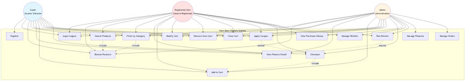

# Diagrama de Casos de Uso - Nam Nam Chicken

## Descripción
Este diagrama muestra las interacciones entre los diferentes actores del sistema y los casos de uso disponibles para cada tipo de usuario.

## Actores
- **Guest (Usuario Visitante)**: Usuario no autenticado que puede navegar y buscar productos
- **Registered User (Usuario Registrado)**: Usuario autenticado con acceso a funcionalidades adicionales
- **Admin (Administrador)**: Usuario con privilegios administrativos

## Diagrama

```mermaid
graph TB
    subgraph "Nam Nam Chicken System"
        %% Guest User Cases
        Register[Register]
        Login[Login/Logout]
        BrowseProducts[Browse Products]
        SearchProducts[Search Products]
        FilterCategory[Filter by Category]
        ViewDetail[View Product Detail]
        AddToCart[Add to Cart]
        ModifyCart[Modify Cart]
        RemoveCart[Remove from Cart]
        ClearCart[Clear Cart]
        ApplyCoupon[Apply Coupon]
        Checkout[Checkout]

        %% Registered User Only
        ViewHistory[View Purchase History]
        ManageWishlist[Manage Wishlist]
        PostReview[Post Review]

        %% Admin Only
        ManageProducts[Manage Products]
        ManageOrders[Manage Orders]
    end

    Guest((Guest<br/>Usuario Visitante))
    RegUser((Registered User<br/>Usuario Registrado))
    Admin((Admin<br/>Administrador))

    %% Guest connections
    Guest --> Register
    Guest --> Login
    Guest --> BrowseProducts
    Guest --> SearchProducts
    Guest --> FilterCategory
    Guest --> ViewDetail
    Guest --> AddToCart
    Guest --> ModifyCart
    Guest --> RemoveCart
    Guest --> ClearCart
    Guest --> ApplyCoupon
    Guest --> Checkout

    %% Registered User connections (inherits from Guest)
    RegUser --> Login
    RegUser --> BrowseProducts
    RegUser --> SearchProducts
    RegUser --> FilterCategory
    RegUser --> ViewDetail
    RegUser --> AddToCart
    RegUser --> ModifyCart
    RegUser --> RemoveCart
    RegUser --> ClearCart
    RegUser --> ApplyCoupon
    RegUser --> Checkout
    RegUser --> ViewHistory
    RegUser --> ManageWishlist
    RegUser --> PostReview

    %% Admin connections (inherits from Registered User)
    Admin --> Login
    Admin --> BrowseProducts
    Admin --> SearchProducts
    Admin --> FilterCategory
    Admin --> ViewDetail
    Admin --> AddToCart
    Admin --> ModifyCart
    Admin --> RemoveCart
    Admin --> ClearCart
    Admin --> ApplyCoupon
    Admin --> Checkout
    Admin --> ViewHistory
    Admin --> ManageWishlist
    Admin --> PostReview
    Admin --> ManageProducts
    Admin --> ManageOrders

    %% Relationships
    SearchProducts -.include.-> BrowseProducts
    FilterCategory -.include.-> BrowseProducts
    Checkout -.include.-> AddToCart
    PostReview -.require.-> ViewDetail
    ApplyCoupon -.extend.-> Checkout

    style Guest fill:#e1f5ff
    style RegUser fill:#ffe1e1
    style Admin fill:#fff4e1
```

Ver código Mermaid

